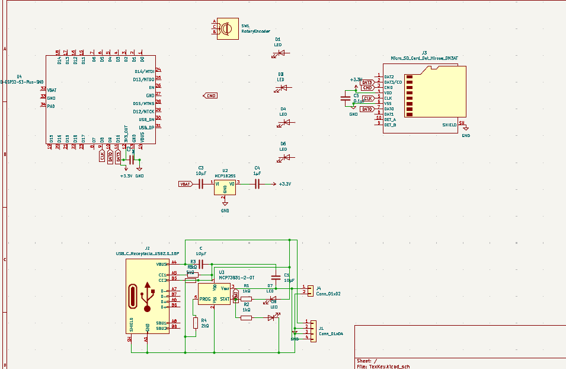
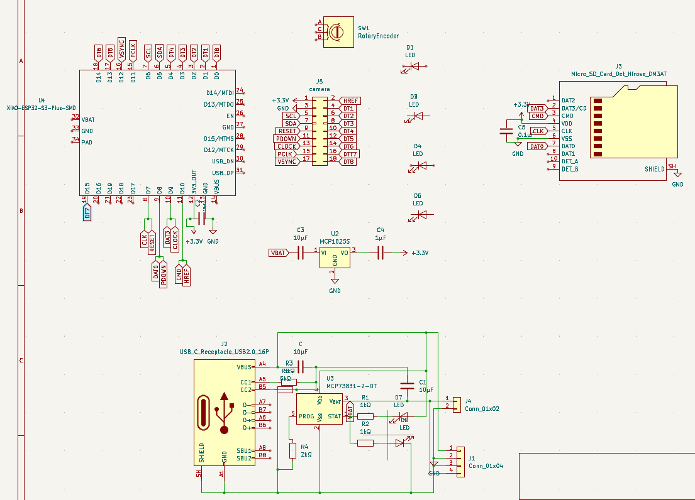
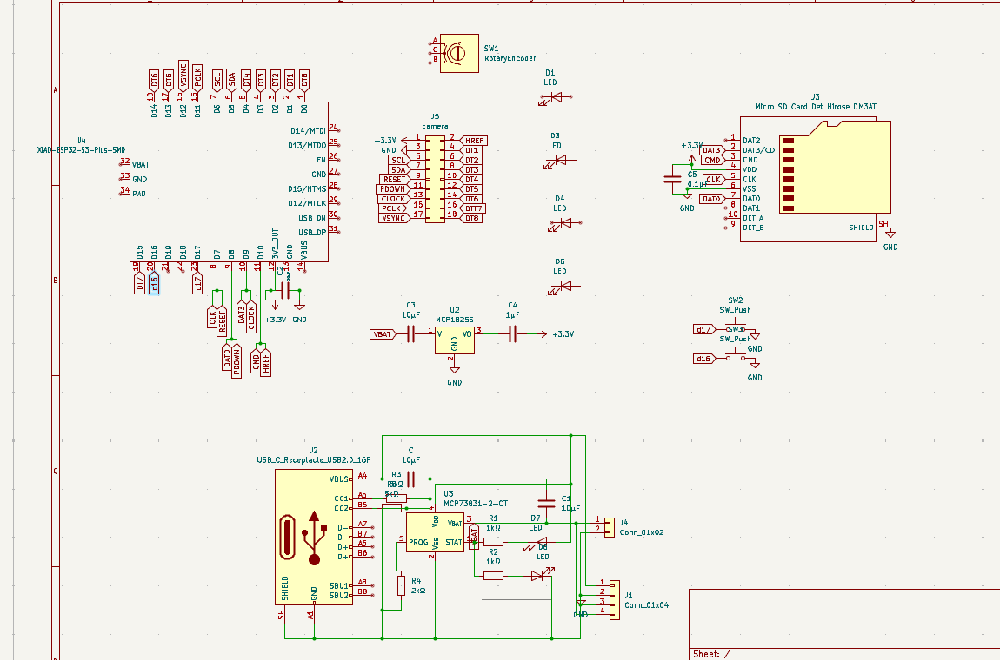
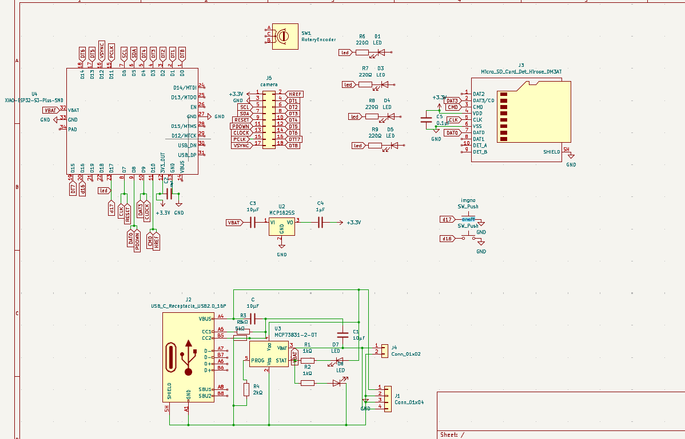
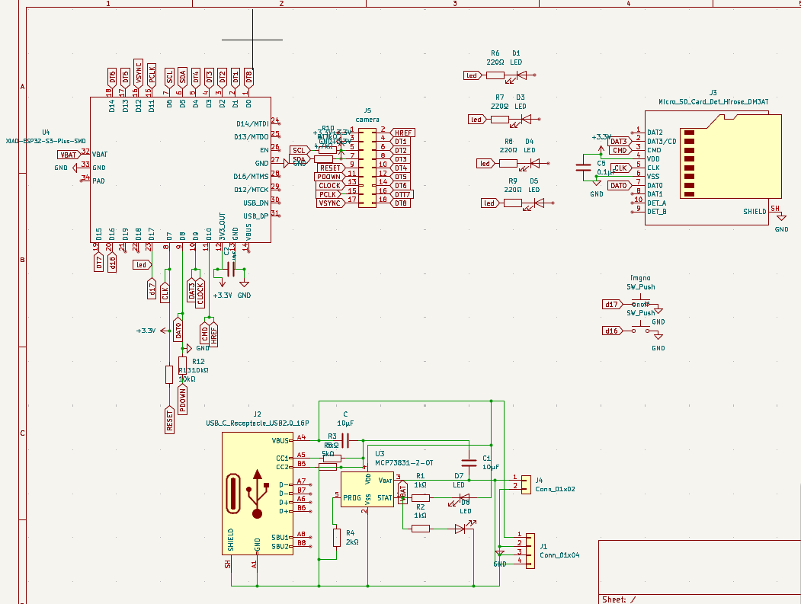
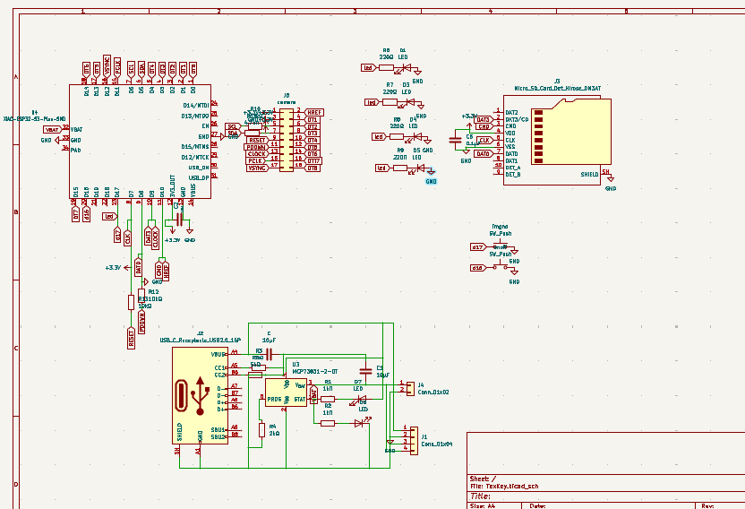
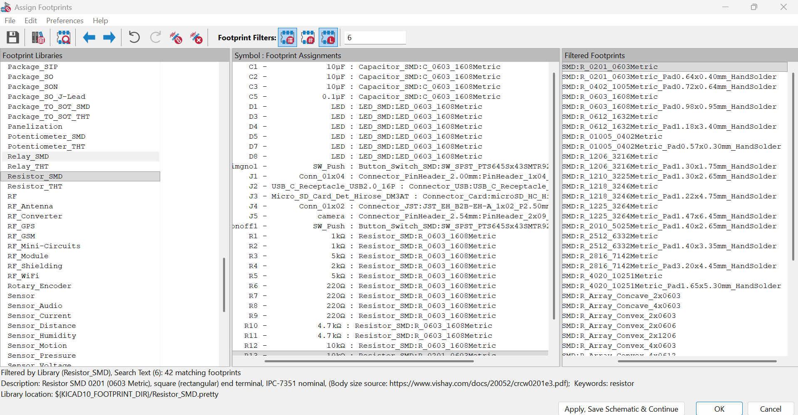
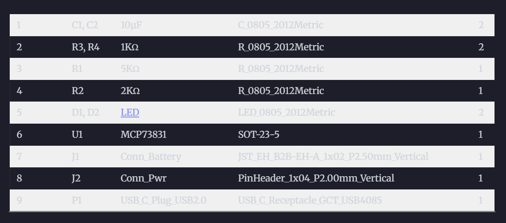
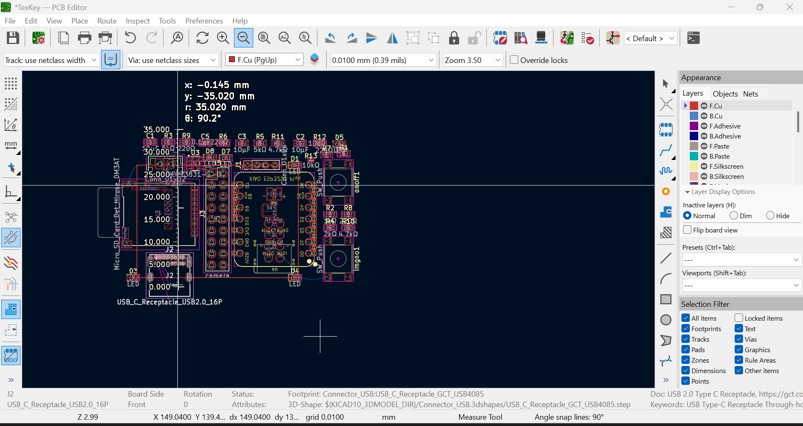
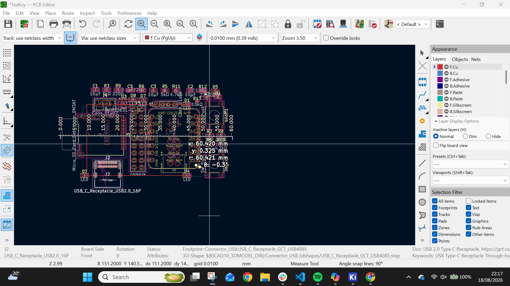

day 5 / day 2  2 days since i started tex key and ditched obs pocket 
16/8/26 21:58 start 
i am sick of lapse lowk , for some reason my laptop switches off every 30mins bc of it and now it is getting jarring .
heres whats on the menu today
finish up schematic , yesterday i read through a bunch of lipo charger guides to complete that module , today was camera day . hardest part to choose lowk . now my original plan was to get a csi rod , it was too expensive and far too big , plan 2 was to use 2-3 smaller cameras and my biggest candidate for that was the OV2640 , however 2-3 of those would be hard to use with the esp 32 c6 mini although the recent esp32 c6 can interface with a dvp camera ( OV2640) multiple cameras would require switching while we require it to run in parallel , so i had a brief idea to swap it with a xiao seed esp32 s3 plus ( mostly due to the 16mb ram  it provides ) or an esp32 p4 ( for its camera paralleling abities (not a word ik)) . anyways i changed nothing . ive already doen tm on the esp 32 c6 to change now . so we are going to go with one camera probabbly OV3660 which is currently my top choice, but a huge issue is the focus ive decided to introduce a skirt of 1-1.5 cm that keeps the camera at a constant distance .But the OV3660 doesnt really focust atp , it need about 8 cm i belive which is more like a camera than a scanner so thats a huge issue. now searching for those - 22:18
Yk how i said we're not changing the micro controller , well i lied we are now using the xiao seeed esp32 s3 sense , with a ov564o camera. currently reading the data sheet 
theyve also got a camera version not sure how that works but ye 
https://wiki.seeedstudio.com/xiao_esp32s3_getting_started/#for-seeed-studio-xiao-esp32-s3-sense-camera
also i can then ditch the complicated ah lipo charging module , even though its completed i highly doubt wether it works or not as its my first time doing it so wooo.
 -23:32
 ive added the seeed s3 and now connecting it to the the stuff that was previously connected to the c6 mini. apparently its not very compatible with the micro sd card but its not as bad as the c6's issue with the cameras so its fine. time to sleep asw so gn
  -12:O5

Day 3 - 23:38 start 
okay i am acc really gonna lock innnnn today , so first on the agenda is finding out the ov564O's schematic or the pin order. -23:39
so ive realised i should never research late at night, omdssssss so the name of the seeed stuck with me , and beacuse i was in a whole another world i mixed it up with the esp p4. idk about yall but s3 and p4 are way too similar in terms of numbers and letters , and genuinely i am concerned about the fact that i didnt think to check after adding everything and have only now realised after finding a great camera module but it needs like 9 pins which would be tm and the xiao doesnt have that many pins , so were stuck at one . BUT GOSH THE FUMBLE.
anyways heres the camera module i REALLLLLLLYYYYY like 
https://thepihut.com/products/adafruit-ov5640-camera-breakout-72-degree-lens-with-autofocus?srsltid=AfmBOopZrM70GV_3OYB7xb9iceAZI2vZ1bu50OTEcgcqH__8C93ymp72 its so peak fam, or should i say cam.
its expensive lowk so 1 is good , 1 is fine -23 smth
 okay so ive spent a long time looking through the data sheet and stuff on github and also day dreaming abt the finished product , so heres what we're gonna do , the cads gonna be a cylinder but the interior is lowk like a chimney( youll see) so imma finish schematic tn fs trust , anyways basically we're not ditching the power module but we're gonna wire it to the xiao so the usb port is the same . no need for 2 innit. also introducing 2 buttons , an on off one and one to take pictures that if you keep pressed it takes multiple. which the person can then stitch together 
https://github.com/adafruit/Adafruit-OV5640-Camera-Breakout-PCB/tree/main    - github for camera featuring schematic - 1:54 am
switches locked and loaded- 2:o6

d16 is for on off d17 is for amt of pics

leds connected , gonna remove rotary bc its not really needed now doing last min checks before moving to pcb 2:15
im back and ive just spent an hour learning about pull ups in depth (not the excercise)
and also implemented them into the reset , power down , sda and scl . According to the numerous number of google drop down reccomended questions (i cant pin point where i read it lmao) reset needs to be low throughout and pwdown despite its name is the opposite and is an active high pin . also 4.7 k ohm on sda and scl for line stability , and to prevent any miscommunications between the seeed and the camera

anywyas goodnight -3:25
after adding gnd to leds

-3:51
2O:1O -START DAY 3
HIYA , just added boxes and labelled compnents, gonna add footprints and do do the pcb now.
 adding footprints, decided on o6o3 rather than the o8o5 , not really much of a difference tbh except the o.o2" size differnce so were goinf with the o6o3 . the battery circuit does reccomend the o8o5 for the capacitators bc the 1o uf is slightly cheaper and easier to fine but bc were using the o6o3 for everyhthing im changing it to o6o3. - reccomended ( the main componets are used as described for the most part )-21:43 (-1 hr break lowk)
 got the layout right and the height is 3.5 cm which is the perfect pocket size
width is at 6 cm which is 2 cm more than id like but its fine , still a good size -22:2o
stop for now bc ts lowk pmo-23:4o