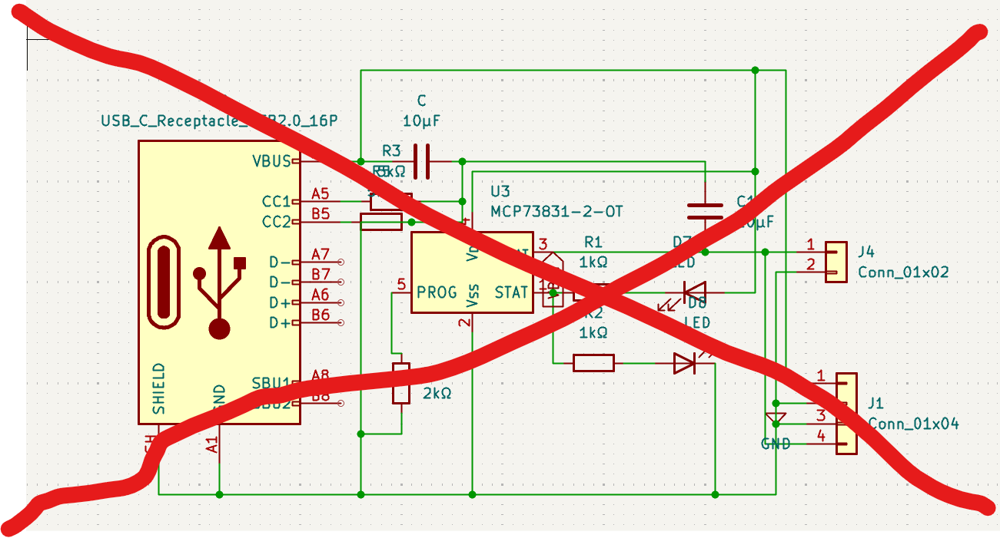

day 5 / day 2  2 days since i started tex key and ditched obs pocket 
16/8/26 21:58 start 
i am sick of lapse lowk , for some reason my laptop switches off every 30mins bc of it and now it is getting jarring .
heres whats on the menu today
finish up schematic , yesterday i read through a bunch of lipo charger guides to complete that module , today was camera day . hardest part to choose lowk . now my original plan was to get a csi rod , it was too expensive and far too big , plan 2 was to use 2-3 smaller cameras and my biggest candidate for that was the OV2640 , however 2-3 of those would be hard to use with the esp 32 c6 mini although the recent esp32 c6 can interface with a dvp camera ( OV2640) multiple cameras would require switching while we require it to run in parallel , so i had a brief idea to swap it with a xiao seed esp32 s3 plus ( mostly due to the 16mb ram  it provides ) or an esp32 p4 ( for its camera paralleling abities (not a word ik)) . anyways i changed nothing . ive already doen tm on the esp 32 c6 to change now . so we are going to go with one camera probabbly OV3660 which is currently my top choice, but a huge issue is the focus ive decided to introduce a skirt of 1-1.5 cm that keeps the camera at a constant distance .But the OV3660 doesnt really focust atp , it need about 8 cm i belive which is more like a camera than a scanner so thats a huge issue. now searching for those - 22:18

Yk how i said we're not changing the micro controller , well i lied we are now using the xiao seeed esp32 s3 sense , with a ov564o camera. currently reading the data sheet 
theyve also got a camera version not sure how that works but ye 
https://wiki.seeedstudio.com/xiao_esp32s3_getting_started/#for-seeed-studio-xiao-esp32-s3-sense-camera
also i can then ditch the complicated ah lipo charging module , even though its completed i highly doubt wether it works or not as its my first time doing it so wooo.
 -23:32
ive added the seeed s3 and now connecting it to the the stuff that was previously connected to the c6 mini. apparently its not very compatible with the micro sd card but its not as bad as the c6's issue with the cameras so its fine.
time to sleep asw so gn

